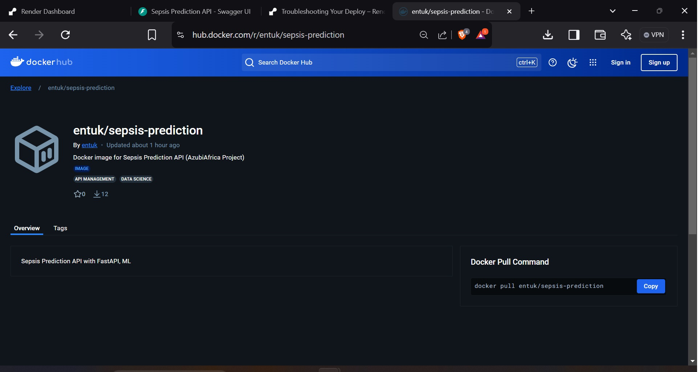

Deployment is usually the last step in any Data Science Project. To be able to integrate your ML model to a web application is quite an important task. There are many popular frameworks that can be used to do this task like Streamlit and Docker.  Another alternative, Django, is usually used for large scale application and takes quite a bit of time to set up, while Docker is usually your go-to for quickly deploying your model on a web app. Apart from the three mentioned, there is another framework that is becoming quite popular, so much so that companies like Netflix and Uber are using it, and that framework is FastAPI. So, let’s understand what’s making FastAPI so popular and how you can use it to deploy ML models as an API.

### INSTALLING FASTAPI
Installing FastAPI is the same as any other python module, but along with FastAPI, you also need to install uvicorn to work as a server. Before starting your project, create a dedicated virtual environment using the code python -m venv myvenv 
To install fastapi and uvicorn, use the code pip install fastapi uvicorn
You can go ahead and install other necessary dependencies such as pandas, numpy, and joblib related to your ML project.  

### CREATING AN ML MODEL API USING FASTAPI
First, you source, load, and clean the needed data with python. Then, you process the data for modeling using any model or set of models. Train and test the data, then save your model(s) using joblib or pickle library. 
Next, you create an API defining the expected feature names and data types. Then incorporate your saved model into the API.
After creating your API using FastAPI, you run the app using uvicorn light-weight server.
With your FastAPI running, you feed it the expected (set of) data, select a model of choice, and then get a prediction based on the new data.
 After getting satisfied with your app functionality, you can deploy it to Swagger UI or Render via your Github repository.

You can also deploy your app at Docker Hub. Docker Hub lets you deploy your FastAPI in a containerized form with everything in the right place.

  

  

